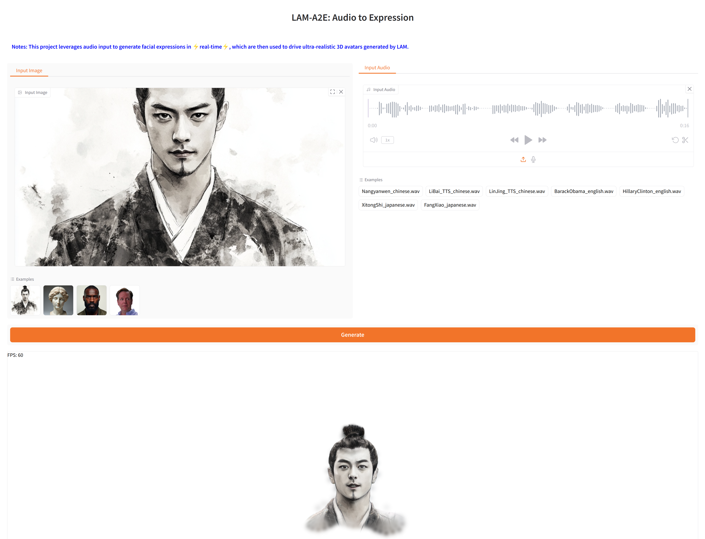

# LAM-A2E: Audio to Expression

[](https://aigc3d.github.io/projects/LAM/) 
[](https://www.apache.org/licenses/LICENSE-2.0)

#### This project leverages audio input to generate ARKit blendshapes-driven facial expressions in ⚡real-time⚡, powering ultra-realistic 3D avatars generated by [LAM](https://github.com/aigc3d/LAM).

## Demo

<div align="center">
  <video controls src="https://github.com/user-attachments/assets/30ccbe82-7933-4031-8578-b5248435d317">
  </video>
</div>

## 📢 News


### To do list
- [ ] Release Huggingface space.
- [ ] Release Modelscope space.
- [ ] Release the LAM-A2E model based on the Flame expression.
- [ ] Release Interactive Chatting Avatar SDK with [OpenAvatarChat](https://github.com/HumanAIGC-Engineering/OpenAvatarChat), including LLM, ASR, TTS, LAM-Avatars.


## 🚀 Get Started
### Environment Setup
```bash
git clone git@github.com:aigc3d/LAM_Audio2Expression.git
cd LAM_Audio2Expression
# Install with Cuda 12.1
sh  ./scripts/install/install_cu121.sh
# Or Install with Cuda 11.8
sh ./scripts/install/install_cu118.sh
```


### Download

```
# HuggingFace download
# Download Assets and Model Weights
huggingface-cli download 3DAIGC/LAM_audio2exp --local-dir ./
tar -xzvf LAM_audio2exp_assets.tar && rm -f LAM_audio2exp_assets.tar
tar -xzvf LAM_audio2exp_streaming.tar && rm -f LAM_audio2exp_streaming.tar


# Or OSS Download (In case of HuggingFace download failing)
# Download Assets
wget https://virutalbuy-public.oss-cn-hangzhou.aliyuncs.com/share/aigc3d/data/LAM/LAM_audio2exp_assets.tar
tar -xzvf LAM_audio2exp_assets.tar && rm -f LAM_audio2exp_assets.tar
# Download Model Weights
wget https://virutalbuy-public.oss-cn-hangzhou.aliyuncs.com/share/aigc3d/data/LAM/LAM_audio2exp_streaming.tar
tar -xzvf LAM_audio2exp_streaming.tar && rm -f LAM_audio2exp_streaming.tar
```


### Quick Start Guide
#### Using <a href="https://github.com/gradio-app/gradio">Gradio</a> Interface: 
We provide a simple Gradio demo with **WebGLGL Render**, and you can get rendering results by uploading audio in seconds.




```
python app_lam_audio2exp.py
```

### Inference
```bash
# example: python inference.py --config-file configs/lam_audio2exp_config_streaming.py --options save_path=exp/audio2exp weight=pretrained_models/lam_audio2exp_streaming.tar audio_input=./assets/sample_audio/BarackObama_english.wav
python inference.py --config-file ${CONFIG_PATH} --options save_path=${SAVE_PATH} weight=${CHECKPOINT_PATH} audio_input=${AUDIO_INPUT}
```

### Acknowledgement
This work is built on many amazing research works and open-source projects:
- [FLAME](https://flame.is.tue.mpg.de)
- [FaceFormer](https://github.com/EvelynFan/FaceFormer)
- [Meshtalk](https://github.com/facebookresearch/meshtalk)
- [Unitalker](https://github.com/X-niper/UniTalker)
- [Pointcept](https://github.com/Pointcept/Pointcept)

Thanks for their excellent works and great contribution.


### Related Works
Welcome to follow our other interesting works:
- [LAM](https://github.com/aigc3d/LAM)
- [LHM](https://github.com/aigc3d/LHM)


### Citation
```
@inproceedings{he2025LAM,
  title={LAM: Large Avatar Model for One-shot Animatable Gaussian Head},
  author={
    Yisheng He and Xiaodong Gu and Xiaodan Ye and Chao Xu and Zhengyi Zhao and Yuan Dong and Weihao Yuan and Zilong Dong and Liefeng Bo
  },
  booktitle={arXiv preprint arXiv:2502.17796},
  year={2025}
}
```
